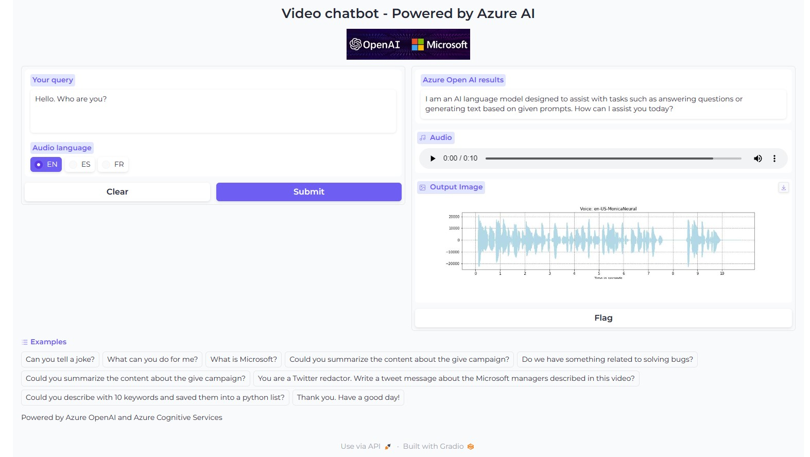
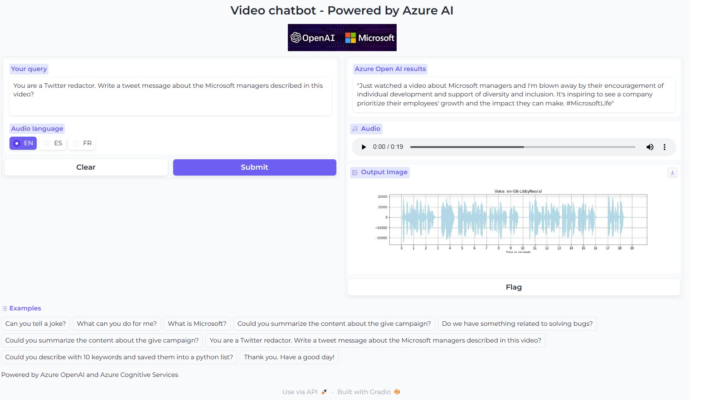
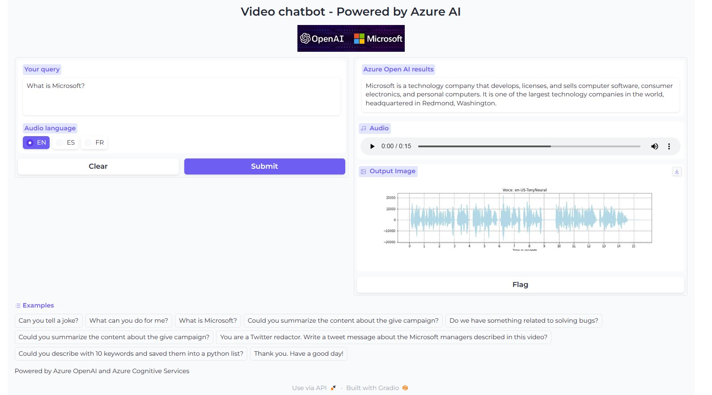
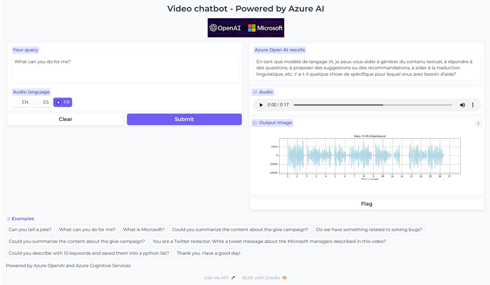

# Video Analytics with Azure AI with a chatGPT like experience

A quick prototype of a video analytics solution to analyse content from a video with a chatGPT like experience using Azure Computer Vision for dense captionning and OCR, Azure Speech Services for speech to text, Azure Open AI and LangChain.

## Process
- Frames extraction from the video file
- Generating dense captioning from the frames using Azure Computer Vision 4 (Florence)
- Generating OCR from the frames using Azure Computer Vision 4 (Florence)
- Extracting the audio part from the video and speech to text generation using Azure Speech Services
- Use of Azure Open AI and LangChain
- Storing the results into Faiss DB
- Creating and using a bot for a chatGPT like experience
- An example of a webapp using GRADIO

## Documentation
- https://learn.microsoft.com/en-us/azure/cognitive-services/computer-vision/overview
- https://learn.microsoft.com/en-us/azure/cognitive-services/openai/overview

## Some examples

19-Apr-2023 Serge Retkowsky | serge.retkowsky@microsoft.com | https://www.linkedin.com/in/serger/
